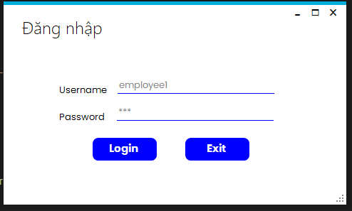
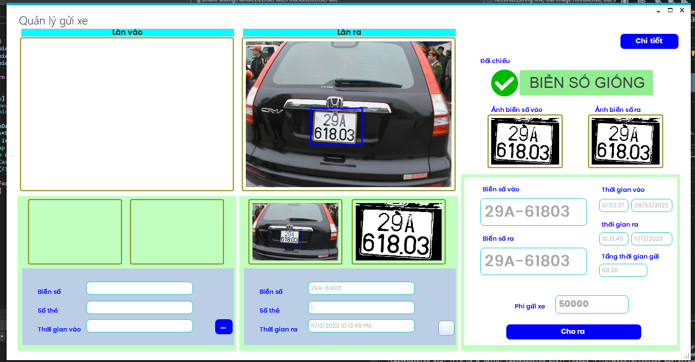
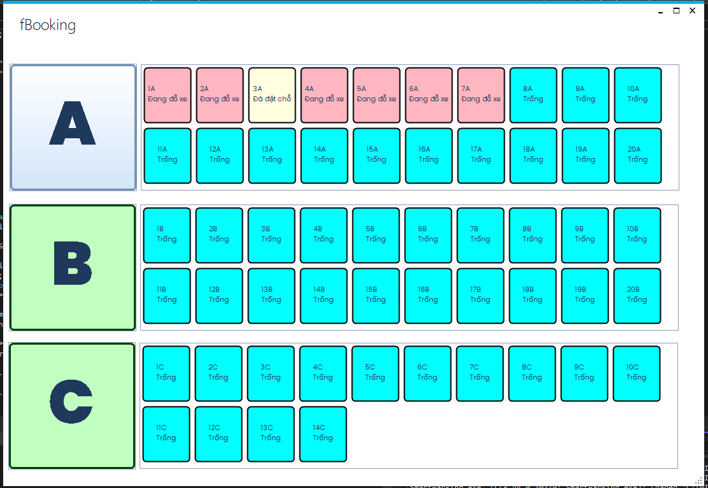
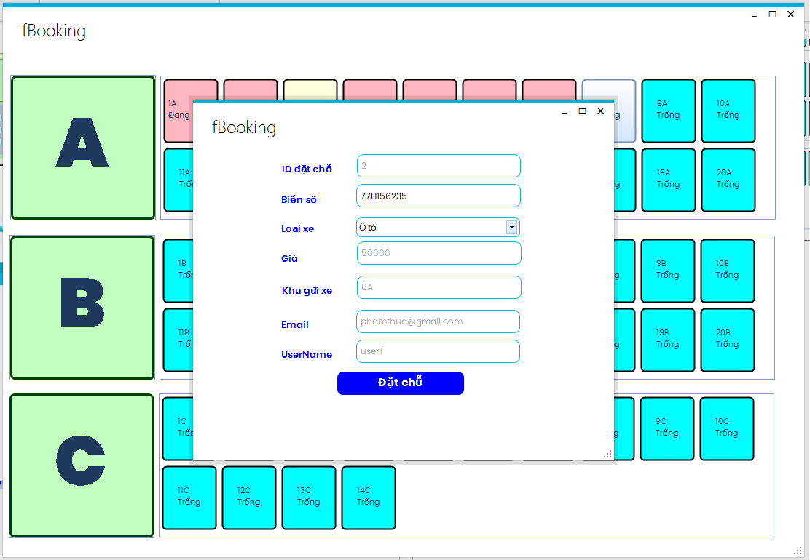
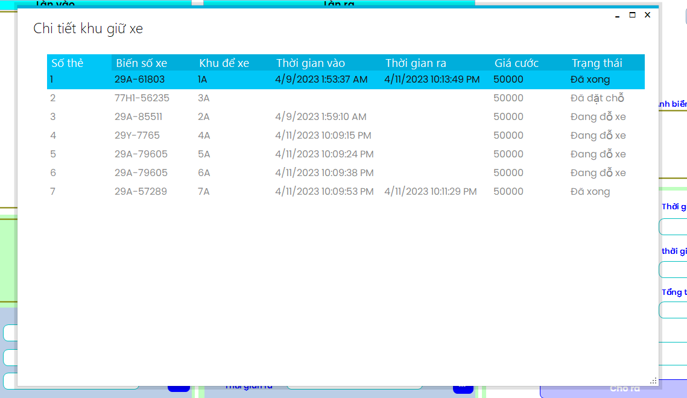
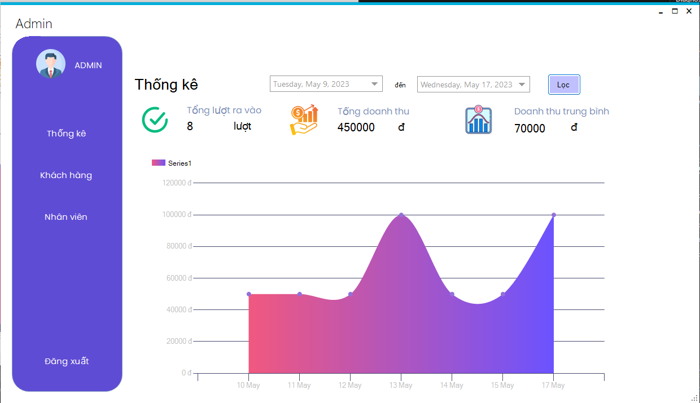
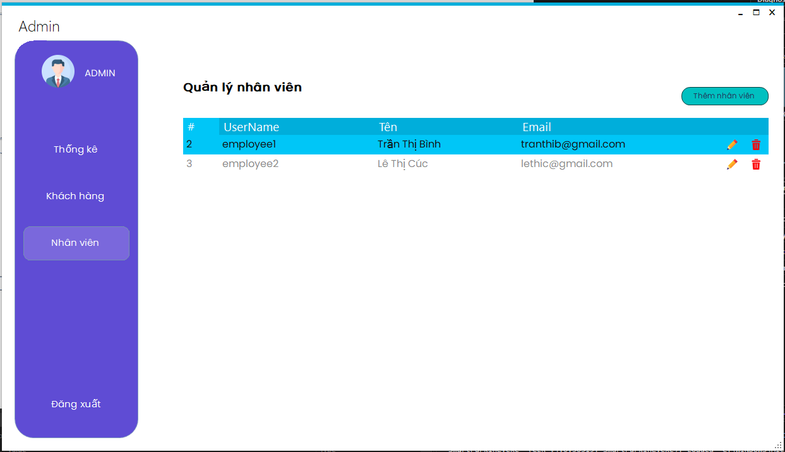

# Hệ thống Bãi Giữ Xe Thông Minh

## Mô tả

Dự án Bãi Giữ Xe Thông Minh là một ứng dụng được phát triển bằng C# WinForms và EmguCV để nhận dạng biển số xe. Ứng dụng này cung cấp các tính năng đăng ký, đăng nhập, xử lý biển số xe, check-in, check-out và quản lý xe trong bãi. Ngoài ra, ứng dụng còn cung cấp tính năng quản trị viên để thực hiện các chức năng như thông kê doanh thu và quản lý nhân viên.

## Công nghệ

- C# WinForms: Sử dụng để xây dựng giao diện người dùng cho ứng dụng.
- EmguCV: Thư viện xử lý ảnh và video dựa trên OpenCV cho C#. Sử dụng để nhận dạng biển số xe từ hình ảnh.

## Tính năng

1. **Đăng ký và Đăng nhập:**

   - Cho phép người dùng đăng ký tài khoản mới và đăng nhập vào hệ thống để sử dụng các tính năng.

   

2. **Xử lý biển số xe:**
   - Tự động nhận dạng biển số xe từ hình ảnh hoặc video sử dụng EmguCV.
3. **Check-in và Check-out:**

   - Người dùng có thể thực hiện việc check-in và check-out xe trong bãi đỗ xe thông qua giao diện người dùng.

   

4. **Đặt chỗ:**

   

   

5. **Quản lý xe trong bãi:**

   - Hiển thị danh sách các xe đang được giữ trong bãi và cho phép người dùng thực hiện các thao tác như xem chi tiết, xóa, hoặc chỉnh sửa thông tin xe.
     

6. **Tính năng quản trị viên:**

   - **Thống kê doanh thu:** Hiển thị báo cáo về doanh thu từ việc giữ xe trong một khoảng thời gian nhất định.

     

   - **Quản lý nhân viên:** Cho phép quản trị viên thêm, xóa và chỉnh sửa thông tin nhân viên trong hệ thống.

     

7. **Giao diện người dùng thân thiện:**
   - Xây dựng giao diện người dùng dễ sử dụng và thân thiện, giúp người dùng tương tác với hệ thống một cách dễ dàng và thuận tiện.

## Hướng dẫn cài đặt và sử dụng

1. **Cài đặt môi trường phát triển:**

   - Đảm bảo bạn đã cài đặt Visual Studio hoặc môi trường phát triển C# khác trên máy tính của bạn.

2. **Clone dự án từ GitHub:**

   - Sử dụng lệnh sau để clone dự án từ GitHub:
     ```
     git clone git@github.com:dient16/SmartPacking.git
     ```

3. **Cài đặt các thư viện cần thiết:**

   - Sử dụng NuGet Package Manager trong Visual Studio để cài đặt các thư viện cần thiết như EmguCV.

4. **Mở dự án trong Visual Studio:**

   - Mở file solution của dự án bằng Visual Studio.

5. **Cấu hình và chạy ứng dụng:**

   - Cấu hình các thông số kết nối cần thiết (nếu có) trong ứng dụng.
   - Sau đó, chạy ứng dụng trong môi trường Debug hoặc Release để kiểm tra tính năng của nó.

6. **Sử dụng và kiểm tra các tính năng:**

   - Đăng ký tài khoản, đăng nhập và sử dụng các tính năng được cung cấp trong ứng dụng.
   - Kiểm tra tính năng nhận dạng biển số xe, quản lý xe trong bãi và các tính năng quản trị viên.

7. **Tương tác với cộng đồng:**
   - Nếu bạn gặp vấn đề hoặc có ý kiến đóng góp, hãy tạo issue trên GitHub hoặc tham gia vào cộng đồng phát triển của dự án.
